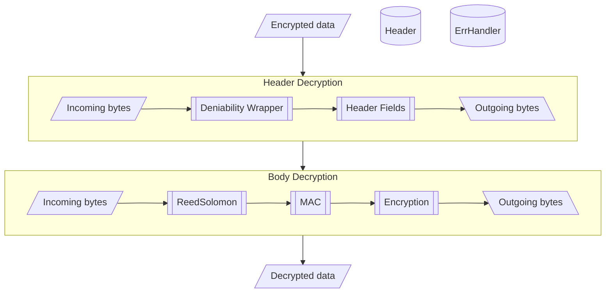
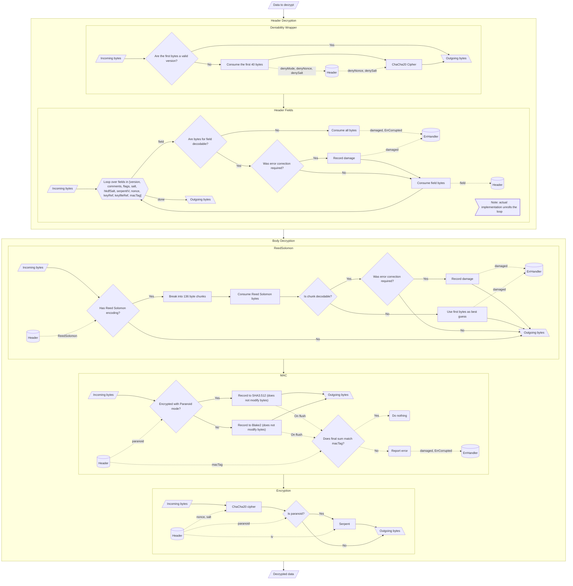
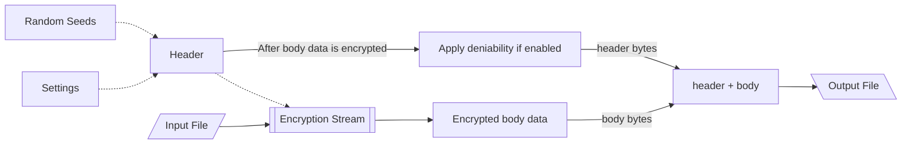
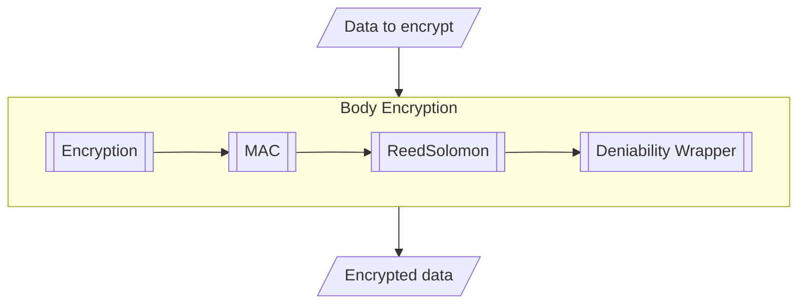
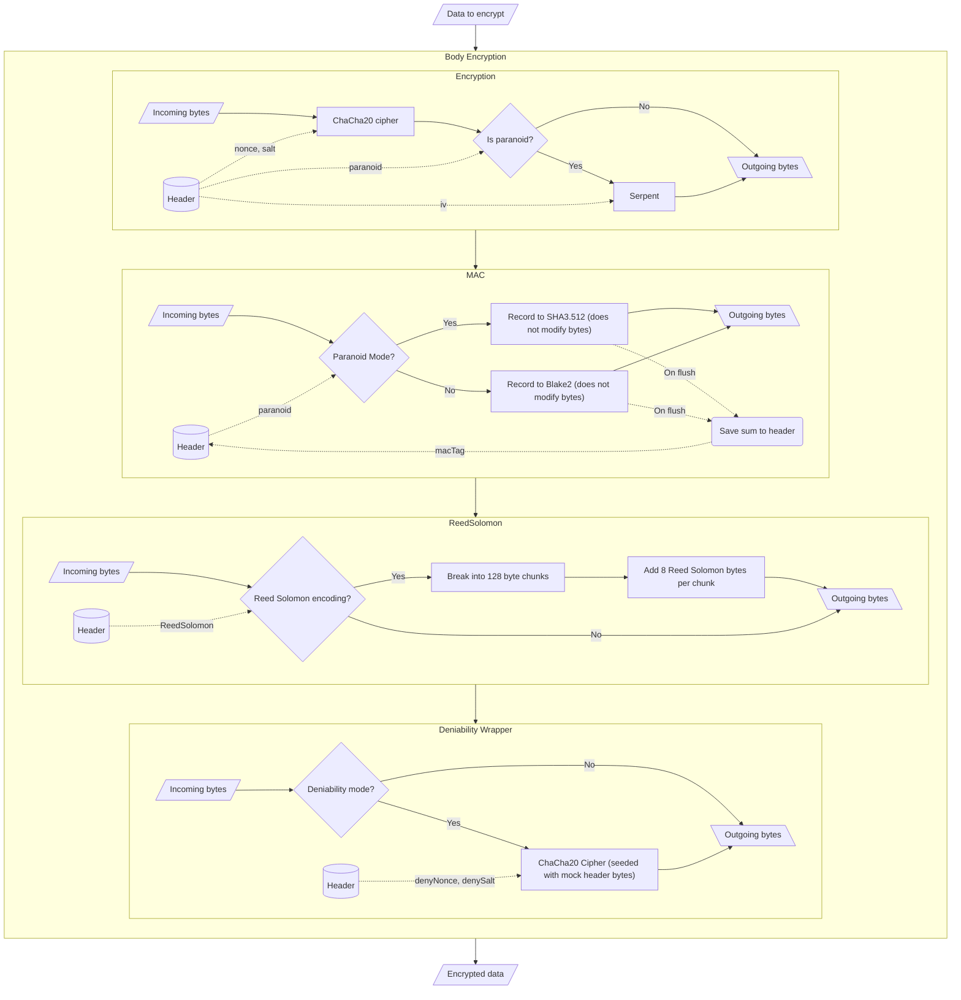

# Code Architecture

Here are some block diagrams of how the code is structured. Not all details are shown, but these diagrams give a reasonably cohesive idea of how data is passed through and modified.

# Decryption
## Low Detail View

Data is first passed through `Header Decryption` which is responsible for initializing the shared `Header` state with correct values, consuming all header-related bytes, and undoing any encryption from deniability mode. By the time data is passed out of `Header Decryption`, the `Header` object is fully initialized and ready to be used. Any encryption related errors or damaged bytes are reported to the shared `ErrHandler`.

Data then passes through `Body Decryption` which is responsible for decoding the file data and checking it for correctness. The data output by `Body Decryption` is fully decoded. Any encryption related errors or damaged bytes
are reported to the shared `ErrHandler`.

## High Detail View

# Encryption

Encryption is broken into 2 steps: encode the file itself through `Encryption Stream`, then combine the `Header` bytes with the encoded body data. These steps are separated because some header data such as the `macTag` cannot be known until the file data has been fully encrypted. The header fields required for `Encryption Stream` are initialized from the passed `Settings` and randomly generated seeds.

## Low Detail View

Low detail view of the `Encryption Stream`. It is very similar to running the `Decryption Stream` in reverse. Data is first passed through `Primary Encryption` (ChaCha20, plus Serpent if paranoid). Then a mac is computed and saved to the header to check against when decrypting. Then Reed-Solomon bytes are added if requested. Then everything is passed through `Deniability Wrapper` (another ChaCha20) if requested. The output bytes are the full body, ready to be appended to the header bytes, which can now be computed.

## High Detail View

